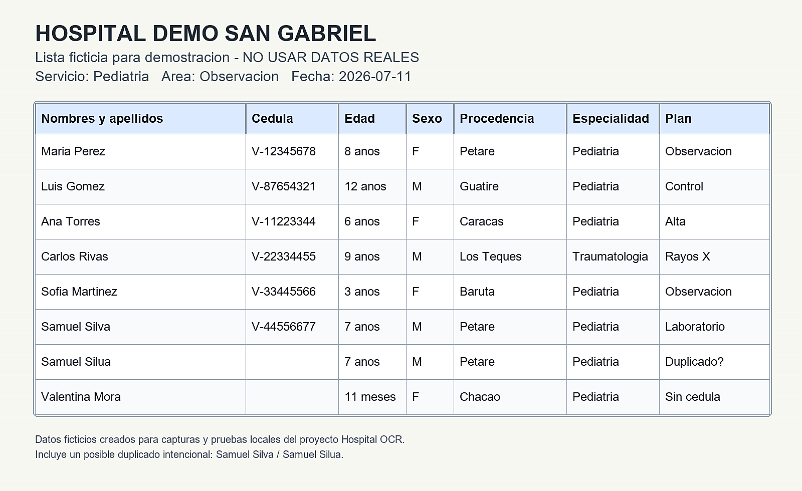
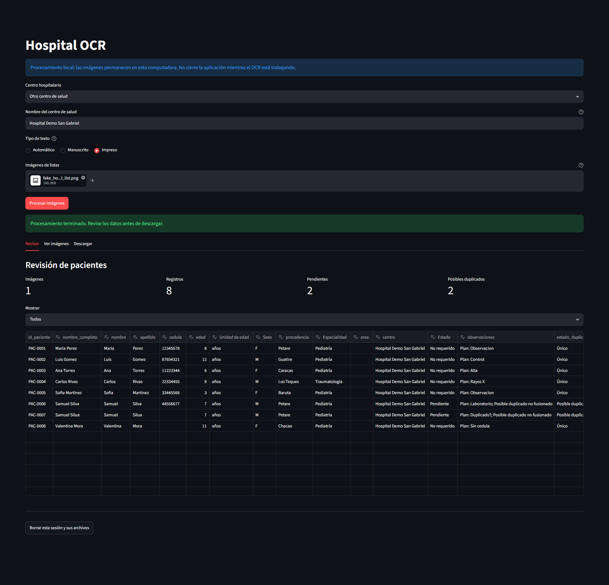
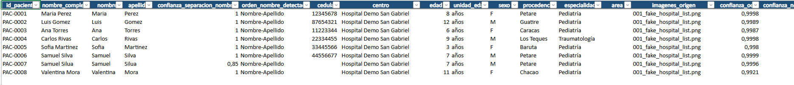
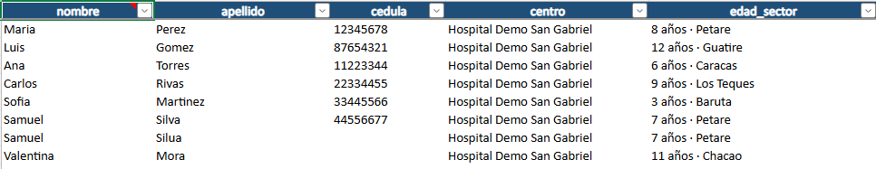

# Hospital List Images to Excel

Herramienta local para convertir imagenes de listas hospitalarias en un archivo Excel revisable. El proyecto usa OCR, reglas de interpretacion y catalogos configurables para extraer pacientes, cedulas, edades, procedencias, especialidades y posibles duplicados.

El procesamiento esta pensado para ejecutarse en la computadora del usuario. Las imagenes, resultados intermedios, cache y archivos Excel generados no se guardan en Git.

## Que Hace

- Procesa una o varias imagenes de listas hospitalarias.
- Detecta tablas, filas, columnas y listas escritas en formato libre.
- Extrae nombre completo, nombre, apellido, cedula, edad, sexo, procedencia, especialidad, area y observaciones.
- Consolida apariciones repetidas de un mismo paciente dentro de un centro.
- Marca posibles duplicados sin fusionarlos automaticamente.
- Genera un Excel con hojas `Pacientes`, `Plantilla` y `Diccionario`.
- Permite revisar y corregir los datos antes de descargar el Excel desde la interfaz web.

## Requisitos

- Windows, macOS o Linux.
- Python `>=3.11,<3.12`.
- Un entorno con las dependencias del proyecto instaladas.
- Conexion a internet solo para instalar dependencias y descargar los modelos OCR la primera vez.

El OCR se ejecuta localmente. La primera corrida puede tardar porque PaddleOCR descarga modelos en `.cache/paddlex`. Las siguientes corridas son mas rapidas gracias a la cache OCR.

## Instalacion

Con Conda:

```powershell
conda create -n hospital-ocr python=3.11
conda activate hospital-ocr
python -m pip install -e .
```

Si ya tienes un entorno preparado con las dependencias pesadas instaladas:

```powershell
conda activate hospital-ocr
python -m pip install -e . --no-deps
```

Para instalar tambien dependencias de pruebas:

```powershell
python -m pip install -e ".[dev]"
```

## Uso Rapido

### Interfaz Web

```powershell
conda activate hospital-ocr
hospital-ocr-web
```

La aplicacion abre Streamlit en `127.0.0.1`. Desde ahi puedes:

- Elegir el centro hospitalario.
- Cargar varias imagenes.
- Seleccionar el tipo de texto: `Automatico`, `Manuscrito` o `Impreso`.
- Ejecutar el OCR.
- Revisar pacientes, pendientes y posibles duplicados.
- Comparar con la imagen original.
- Descargar `pacientes.xlsx`.

Si el centro no aparece en el catalogo, selecciona `Otro centro de salud` y escribe su nombre oficial. Ese valor se usa solo en la sesion actual.

Hay una imagen ficticia para preparar capturas y probar la app sin datos reales:



Puedes cargar `docs/examples/fake_hospital_list.png`, seleccionar `Otro centro de salud` y usar `Hospital Demo San Gabriel` como nombre del centro.

Vista de la interfaz web luego de procesar la imagen de ejemplo:



### Linea de Comandos

La linea de comandos espera imagenes organizadas por centro:

```text
data/input/images/
  hospital_domingo_luciani/
    lista_01.jpg
    lista_02.jpg
  hospital_miguel_perez_carreno/
    lista_03.jpg
```

Cada carpeta debe coincidir con un valor de la columna `carpeta` en `config/centros.csv`.

Procesar todas las imagenes:

```powershell
hospital-ocr
```

Procesar una muestra distribuida de 5 imagenes:

```powershell
hospital-ocr --limit 5 --output data/output/piloto_pacientes.xlsx
```

Reemplazar un Excel existente de forma intencional:

```powershell
hospital-ocr --output data/output/pacientes_consolidados.xlsx --force
```

Elegir modo OCR:

```powershell
hospital-ocr --ocr-mode auto
hospital-ocr --ocr-mode handwritten
hospital-ocr --ocr-mode printed
```

## Modos OCR

- `auto`: modo recomendado. Ejecuta OCR global y refuerza celdas o renglones cuando detecta baja cobertura, campos estructurados o baja confianza. El refuerzo solo se acepta si mejora calidad y conserva cobertura.
- `handwritten`: intenta refuerzo con mayor sensibilidad para listas manuscritas. Si el refuerzo empeora el resultado, se conserva el OCR global.
- `printed`: usa una sola pasada global. Es util para documentos impresos o cuando se quiere evitar el refuerzo.

Los resultados OCR se guardan en cache por contenido de imagen, modo OCR y version de politica. Si cambia la politica OCR, la cache vieja se ignora automaticamente.

## Estructura del Excel

El archivo generado contiene:

- `Pacientes`: hoja principal editable, con una fila por paciente consolidado.
- `Plantilla`: vista protegida con las columnas finales `nombre`, `apellido`, `cedula`, `centro` y `edad_sector`.
- `Diccionario`: descripcion de cada columna, tipo de dato, valores permitidos y ejemplos.

Ejemplo de la hoja `Pacientes`:



Columnas importantes en `Pacientes`:

- `estado_revision`: `Pendiente`, `No requerido` o `Revisado`.
- `observaciones`: motivos de revision, conflictos o notas clinicas extraidas.
- `estado_duplicado`: `Unico`, `Posible duplicado` o `Duplicado consolidado`.
- `detalle_duplicado`: explica con que paciente coincide y por que.
- `imagenes_origen`: imagenes donde aparecio el paciente.
- `linea_ocr_original`: texto OCR original usado como evidencia.
- `confianza_*`: confianza separada para OCR, nombre, cedula, edad, procedencia y especialidad.

La hoja `Plantilla` se alimenta desde `Pacientes`. Haz las correcciones en `Pacientes` y abre/recalcula el libro para que `Plantilla` refleje los cambios.

Ejemplo de la hoja `Plantilla`:



## Revision Humana

El sistema no reemplaza la revision humana. Antes de usar la hoja `Plantilla`, revisa especialmente:

- Filas con `estado_revision = Pendiente`.
- Filas con `estado_duplicado = Posible duplicado`.
- Registros sin cedula.
- Nombres o apellidos vacios.
- Procedencias o especialidades dudosas.
- Registros con observaciones o conflictos.

Las coincidencias aproximadas de nombres no se fusionan automaticamente. Se marcan como posibles duplicados para que una persona decida.

## Catalogos Configurables

Los catalogos viven en `config/`:

- `centros.csv`: relacion entre carpeta y nombre oficial del centro.
- `lugares.csv`: aliases de ciudades, estados, sectores, instituciones y procedencias.
- `especialidades.csv`: aliases de especialidades y areas.
- `nombres_comunes.csv`: nombres frecuentes para separar nombres/apellidos y corregir algunos errores OCR.
- `apellidos_comunes.csv`: apellidos frecuentes.

Cuando agregues aliases, procura usar terminos especificos y revisar que no creen coincidencias ambiguas.

## Evaluacion con Imagenes de Prueba

El corpus privado de evaluacion se guarda en `data/evaluation/test_images/`. Cada imagen debe tener un CSV con el mismo nombre base, codificado en UTF-8 y separado por punto y coma.

Validar estructura sin ejecutar OCR:

```powershell
hospital-ocr-evaluate data/evaluation/test_images --validate-only
```

Ejecutar evaluacion en modo automatico:

```powershell
hospital-ocr-evaluate data/evaluation/test_images --ocr-mode auto
```

Evaluar solo algunas imagenes:

```powershell
hospital-ocr-evaluate data/evaluation/test_images --ocr-mode auto --only test_image_8 --only test_image_17
```

Recalcular metricas desde predicciones existentes sin repetir OCR:

```powershell
hospital-ocr-evaluate data/evaluation/test_images --from-predictions data/evaluation/test_images/results/predicciones
```

Los resultados incluyen resumen JSON, metricas por imagen/campo, diferencias, predicciones y artefactos OCR.

## Directorios

- `src/hospital_ocr/`: codigo fuente del pipeline.
- `src/hospital_ocr/table_extraction/`: deteccion y parsing de tablas.
- `tests/`: pruebas automatizadas.
- `config/`: catalogos editables.
- `data/input/images/`: imagenes de entrada para CLI, excluidas de Git.
- `data/interim/`: preprocesamiento, OCR, auditoria y sesiones web, excluido de Git.
- `data/output/`: Excel generados, excluidos de Git.
- `data/evaluation/`: corpus privado y resultados de evaluacion, excluido de Git.
- `.cache/paddlex/`: modelos y cache OCR local, excluido de Git.

## Privacidad

Las imagenes pueden contener datos medicos sensibles. Por eso el repositorio ignora:

- Imagenes de entrada.
- Corpus de evaluacion.
- Resultados OCR.
- Archivos intermedios.
- Excel finales.
- Cache local.

No subas al repositorio archivos con datos reales de pacientes.

## Desarrollo

Ejecutar pruebas:

```powershell
python -m pytest -q
```

Ejecutar solo pruebas de modos OCR:

```powershell
python -m pytest tests/test_pipeline_modes.py -q
```

Ejecutar solo pruebas de consolidacion:

```powershell
python -m pytest tests/test_consolidation.py -q
```

## Limitaciones Conocidas

- El OCR puede fallar con texto muy borroso, inclinado o manuscrito irregular.
- Los modos `auto` y `handwritten` pueden tardar mas porque prueban refuerzos por celda o renglon.
- La separacion entre nombres y apellidos depende de catalogos y confianza minima.
- Procedencias fuera del catalogo pueden quedar vacias o pendientes.
- Los posibles duplicados requieren revision humana.

## Fuente Inicial del Catalogo de Centros

El catalogo parte de hospitales y centros de referencia de Venezuela. Se tomo como base la lista reproducida en el Plan intersectorial de preparacion y atencion a la COVID-19 de Naciones Unidas en Venezuela, paginas 31 a 33, y se agregaron centros identificados para el proyecto. Es una lista operativa, no un ranking de calidad ni un directorio exhaustivo.
